# Three Ingredient Recipe Selector

Welcome! The Three-Ingredient Recipe Selector is a Command Line Interface application whereby users can retrieve recipes which only require three ingredients.

It is the third project for my Diploma in Full Stack Software Development, and utilises Python.

After users enter their choice of sweet or savoury recipes, and in the latter case their choice of meat or no meat, the user is given a randomly selected recipe from a bank of recipes that matches their criteria.

Users are also asked whether they are happy with the choice of recipe offered, and whether they want to go through the process again.

It is targeted at people who want to try new recipes but may require something simpler to start with.

This is a link to the deployed site: https://three-ingredient-recipe-select-e7093ff803a7.herokuapp.com/

## User Experience (UX)

### User Demographic

The app is intended for:

- Users who want to try new recipes.
- Users who perhaps do not cook much and as such want the recipes to be easy, and not require many ingredients.
- User who want to be able to search for recipes by whether they are sweet or savoury, and whether they contain meat or not.

### User Stories

As a new user I want to:
- Quickly and easily find new, simple recipes.
- Not be restricted to the first recipe choice I am offered.
- Try to cook in ways I would normally not e.g. dessert recipes, vegetarian recipes.

As an existing user I want to:
- Look for more recipes of this type (with three ingredients only), should previous recipes have worked out well.
- Find a complementary recipe to prepare alongside one retrieved previously that has gone well e.g. a dessert to a main.
- Check back for any additions of new recipes.

## Design

The Three-Ingredient Recipe Selector uses a template built by Code Institute. It has a Command Line Interface (CLI) for users to type in their choices. This CLI is boxed against a white background. It is responsive across different screen sizes.

## Ideas Chart

As wireframes were not appropriate for the ideas stage of this project, a chart laying out the flow of choices for the user to make was instead made. This informed the development of functions for the project. 

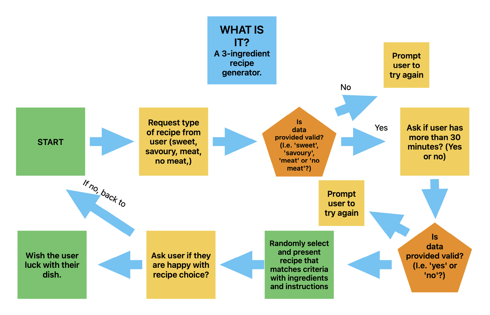

The chart was generally adhered to, but the function to give the user a choice of 30-minute recipes was omitted and, for simplicity, relevant information is given to the user when their recipe suggestion is presented instead, stating whether it takes 30 minutes or under or not.

## Features

As everything takes place via the Command Line Interface, the various steps and choices of the process for the Three-Ingredient-Recipe Selector can be thought of as the features of it, and these are what are outlined below. 

### Existing Features

#### Introduction/Sweet or Savoury

When the user opens the application, they see the welcome screen, which asks them to enter either "sweet" or "savoury".

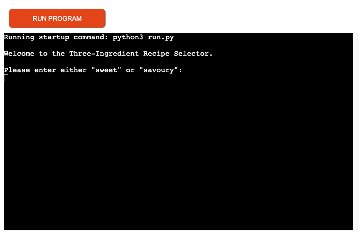

#### Savoury/Meat or No Meat

If the user chooses savoury, they are asked to enter their choice of meat or no meat.

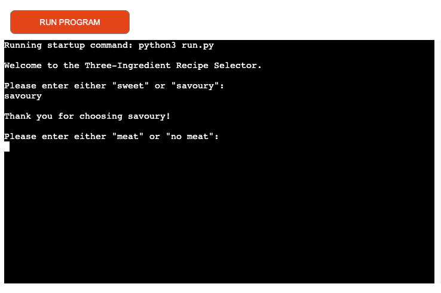

#### Presentation of Recipe

Once the users ha entered either sweet or savoury, and in the case of the latter meat or no meat, they are presented with their recipe.

First, they see the name of their recipe, the 3 ingredients, and whether it takes under 30 minutes or not. 

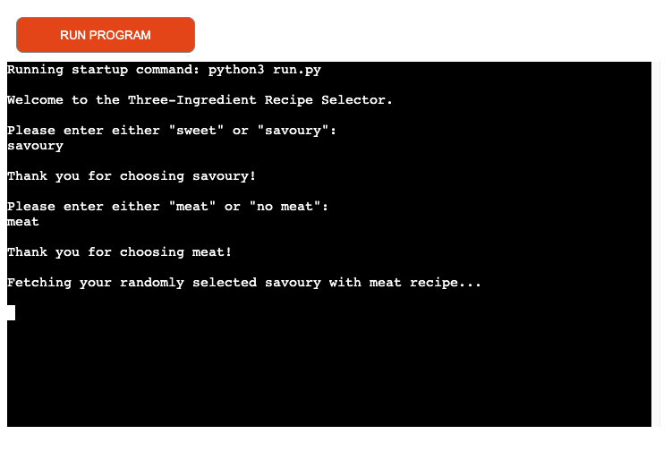

There is a delay in executing the next part of the function that presents the recipes, so that the above information can be registered first by the user. Then, the user is presented with the steps for their recipe. 

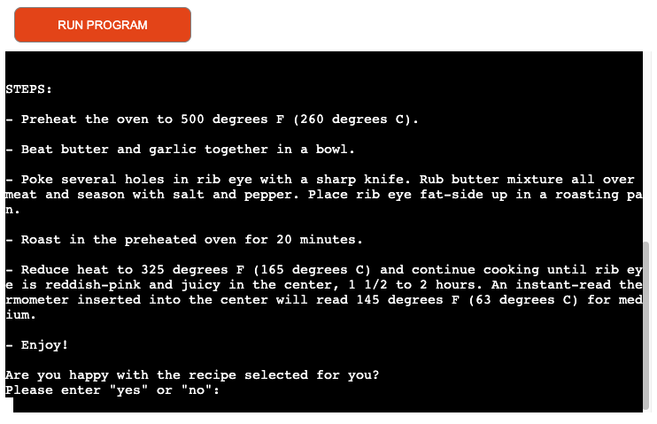

If the user scrolls up from the steps, they will see the recipe name, ingredients and 30 minutes of under information again.

#### Happy or Not 

Once the user has been presented with a recipe that meets their criteria, they are asked whether they are happy with it.

If they input 'yes', a goodbye greeting is presented expressing pleasure at this outcome, and no more choices are presented either, which makes clear the session is over.

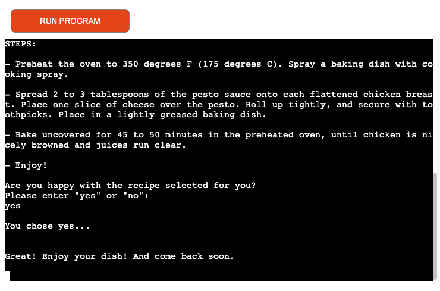

#### Try Again or Not

If the user selects 'no' when asked if they are happy with their recipe, they are offered the chance to try the process again.

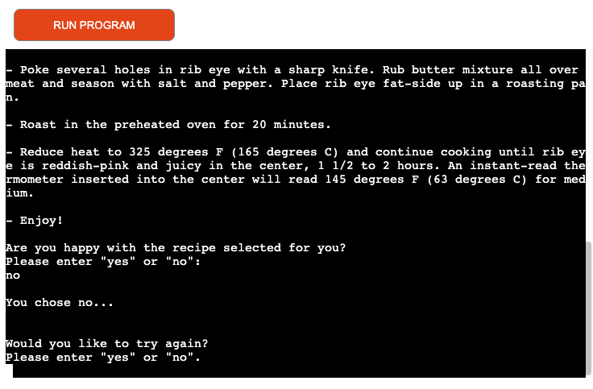

If they select 'no', a goodbye greeting is presented expressing regret at this outcome, and no more choices are presented either, which makes clear the session is over.

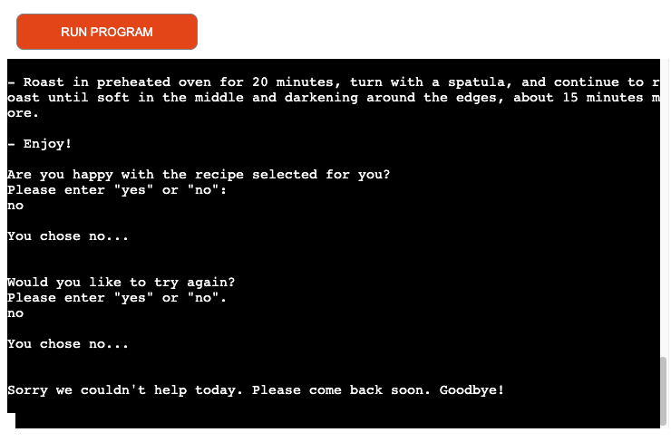

If the user selects 'yes' the process starts again, bringing the user back to the 'sweet' or 'savoury' choice.

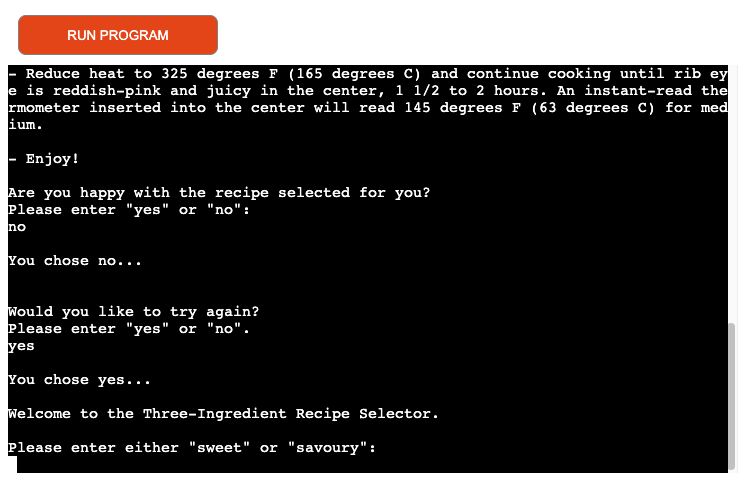

#### Exception/Error Handling

Throughout the whole process, exception/error handling is in place, so that if the user does not enter either of the choices they are prompted to enter at the various steps ('sweet' or 'savoury'; 'meat' or 'no meat'; 'yes' or 'no'), they are told that what they have entered is invalid, and asked to try again. 

The relevant functions all utilise the .lower() method for the user inputs, so that they can enter their choices in lower, upper, or mixed case and it won't matter. 

The screenshots below are a couple of examples of the error messages generated.

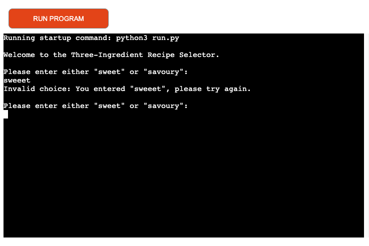

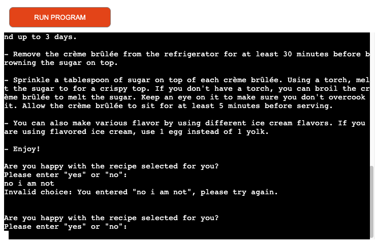

### Features Left To Implement

#### 30 Minutes or Under Choice

If it would be of value to add a choice at the relevant part of the process for the user to select whether they want recipes that take under 30 minutes or not, then this could be added. But there is the risk that this would add too many choices to the process, when the whole idea is that it is quick and easy.

#### Popularity Tracking

Data could be appended to the relevant column of the linked Google Sheet that contains the recipe bank, recording for each recipe whether users said they were happy with it or not. This data could then be sorted in order to obtain the most popular recipes in order. Which could in turn allow for new features, such as offering the user the chance to see the most popular recipe.

## Deployment

### GitHub and Gitpod

The site was set up by creating a new repository on GitHub, using [this](https://github.com/Code-Institute-Org/p3-template) template from Code Institute (which is tailored specifically for this Python project).

The development environment used was Gitpod. This was opened initially via the green 'GitPod' button that appeared on the repo's listing on GitHub.

The initial 'git add', 'git commit' and 'git push' were made on 27 October 2023. There have been over nearly 30 further commits since then.

The regular commits and pushes were sent from GitPod back to the repo on GitHub.

### Google Sheets / Google Cloud Platform

[This](https://docs.google.com/spreadsheets/d/1AuIBEWq0dz5VMooV48XEoDA2cehHjfa4o0A8Hb27b4M/edit?usp=sharing) Google Sheets spreadsheet was set up, to hold the bank of recipes. It is divided into three worksheets - sweet, savoury, and savoury no meat.

Then, an API was set up on the Google Cloud Platform, to allow the Python code in this project to access date in the Google Sheets spreadsheet.

To do this, these steps as outlined by Code Institute for the 'Love Sandwiches' walkthrough project were followed (the instructions refer to the Google Cloud Platform) and adapted as required:

    1. From the "Which API are you using?" dropdown menu, choose Google Drive API
    2. For the "What data will you be accessing?" question, select Application Data
    3. For the "Are you planning to use this API with Compute Engine, Kubernetes Engine, App Engine, or Cloud Functions?" question, select No, I'm not using them
    4. Click Next
    5. Enter a Service Account name, you can call it anything you like - I will call mine "LoveSandwiches" - then click Create
    6. In the Role Dropdown box choose Basic > Editor then press Continue
    7. These options can be left blank, click Done
    8. On the next page, click on the Service Account that has been created
    9. On the next page, click on the Keys tab
    10. Click on the Add Key dropdown and select Create New Key
    11. Select JSON and then click Create. This will trigger the json file with your API credentials in it to download to your machine. 

Then, on the Google Cloud Platform, the Google Sheets API was searched for and then enabled.

Next, this json file was dragged into the file system of the project's Gitpod workspace, and renamed as 'creds.json'. In this file, the 'client email' value was copied to the clipboard. Back in the Google Sheets spreadsheet, the 'Share' button was clicked, and the 'client email' value from the clipboard pasted in, ''Editor' selected, 'Notify People' unticked, and then 'Share' clicked.

The 'creds.json. file was then added to the list in the 'gitignore' file in the file system.

Next, the'gspread' and 'google-auth' packages were installed to the project workspace via the terminal command 'pip3 install gspread google-auth'.

The following code in relation to these installations was then entered at the top of the 'run.py' file:

    import gspread
    from google.oauth2.service_account import Credentials

    SCOPE = [
        "https://www.googleapis.com/auth/spreadsheets",
        "https://www.googleapis.com/auth/drive.file",
        "https://www.googleapis.com/auth/drive",
    ]

    CREDS = Credentials.from_service_account_file("creds.json")
    SCOPED_CREDS = CREDS.with_scopes(SCOPE)
    GSPREAD_CLIENT = gspread.authorize(SCOPED_CREDS)
    SHEET = GSPREAD_CLIENT.open("p3-three-ingredient-recipe-selector")

All of these steps meant that the contents of the Google Sheets spreadsheet could securely be accessed by the python code to populate all parts of the recipes retrieved for the user.

### Heroku

First, dependencies required by Heroku to run the app were placed in the 'requirements.txt.' file in the Gitpod workspace via the terminal command 'pip3 freeze > requirements.txt'.

After once again git-committing and pushing the workspace to GitHub, a new app was set up within Heroku.

Then, for the newly set up app, Settings was selected, and then Reveal Config Vars clicked. The name and contents of the 'cred.json' file in Gitpod was then copied into the Key and Value fields respectively in the Reveal Config Vars section of the Heroku app's settings.

Next, as outlined in complementary text to the relevant Code Institute video, the Key of 'Port' and the value of '8000' was added to the Reveal Config Vars section of the Heroku app's settings.

The 'python' and 'node.js' buildpacks were then added to the app in Heroku, in the order.

In the 'Deploy' section of the Heroku app, GitHub was selected as the method and logged in to. The relevant GitHub repository was then searched for and connected.

Next, the 'Deploy Branch' option was selected to manually make the first deployment of the app to Heroku on 30 October 2023.

Since then, there have been 11 further builds/deployments to Heroku.

## Technologies Used

- Python - to program all elements of how the app functions and moves through steps/choices and returns recipes.
- GitHub - to create and store the repository for the website.
- GitPod - the Integrated Development Environment (IDE) used to build the site, and to 'git commit' and 'git push' back to the GitHub repository.
- Heroku - to deploy the Command Line Interface for the app.
-  Apple Freeform - to design the ideas chart when planning.
- Google Sheets - used to create the spreadsheet to hold data for the bank of recipes.
- Google Cloud Platforms - Used to set up the API so that the project's python could access the data held in the Google Sheet.
- [Code Institute's Python Linter](https://pep8ci.herokuapp.com/) - Used to validate the project's python code (the PEP8 Online validator website is no longer operational).
- Am I Responsive? site - used to generate screenshots of the site across different devices and screen sizes.

## Testing

All parts/steps of the app's process, outlined above in the Features section, were tested to make sure they function properly, with the following confirmed:
- When the user opens the application, they see the welcome screen, which asks them to enter either "sweet" or "savoury". Entering either of these terms in lower, upper or mixed case successfully progresses the user to the next stage. Entering anything other than these exact terms brings up an error/exception handling message, advising the user that what they entered is not valid, and prompting to try again.
- If the user chooses savoury, they are asked to enter their choice of meat or no meat. Entering either of these terms in lower, upper or mixed case successfully progresses the user to the next stage. Entering anything other than these exact terms brings up an error/exception handling message, advising the user that what they entered is not valid, and prompting to try again.
- Once the user has entered either sweet or savoury, and in the case of the latter meat or no meat, they are presented with their recipe. First, they see the name of their recipe, the 3 ingredients, and whether it takes under 30 minutes or not. There is a delay in executing the next part of the function that presents the recipes, so that the above information can be registered first by the user. Then, the user is presented with the steps for their recipe. If the user scrolls up from the steps, they will see the recipe name, ingredients and 30 minutes of under information again.
- Once the user has been presented with a recipe that meets their criteria, they are asked whether they are happy with it, and prompted to enter 'yes' or 'no'. Entering either of these terms in lower, upper or mixed case successfully progresses the user to the next stage. Entering anything other than these exact terms brings up an error/exception handling message, advising the user that what they entered is not valid, and prompting to try again. If they input 'yes', a goodbye greeting is presented expressing pleasure at this outcome, and no more choices are presented either, which makes clear the session is over.
- If the user selects 'no' when asked if they are happy with their recipe, they are offered the chance to try the process again, and prompted to enter 'yes' or 'no'. Entering either of these terms in lower, upper or mixed case successfully progresses the user to the next stage. Entering anything other than these exact terms brings up an error/exception handling message, advising the user that what they entered is not valid, and prompting to try again. If they select 'no', a goodbye greeting is presented expressing regret at this outcome, and no more choices are presented either, which makes clear the session is over. If the user selects 'yes' the process starts again, bringing the user back to the 'sweet' or 'savoury' choice.
- Multiple variations of choices were tested multiple times, ensuring the app worked as expected every time and that, once the criteria set over which the user has a choice, the retrieved recipes were random and varied.

### Validator Testing

As the PEP8 Online validator website is no longer an option, [Code Institute's Python Linter](https://pep8ci.herokuapp.com/) was used to check the project's python code.

The code passed through with no issues.

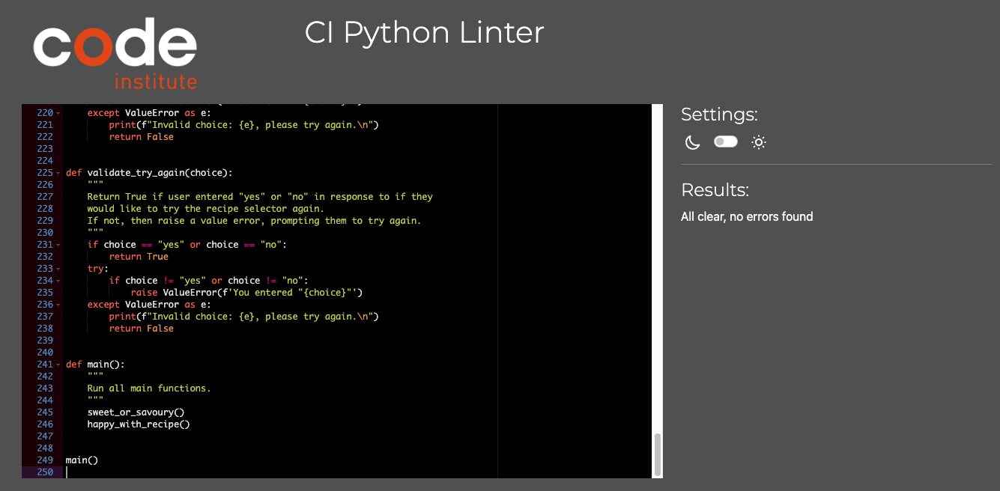

## Unfixed Bugs

There are no unfixed bugs that I am aware of.

## Credits

### Content

The recipes for the project were taken from the following websites:
- https://www.allrecipes.com/gallery/3-ingredient-recipes-for-dinner/
- https://tasty.co/compilation/44-easy-3-ingredient-recipes

I produced all other written content.

